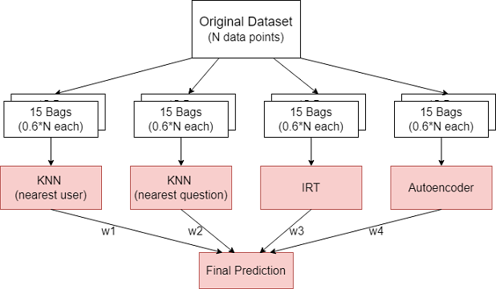
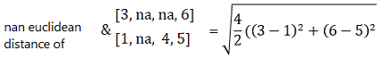

# Predicting-Student-Question-Performance
I led a team of 3 to write an ensemble machine learning model with bagging to predict whether a student can correctly anwser a diagnositic question. Our ensemble combined 3 distinct algorithms (K-Nearest Neighbors, Item-Response Theory, Autoencoder). Motivation was a course project. A generic guide was provided, however implementation details were left to the students.

## Background
Online education services (such as Khan Academy) provide a broad audience with high quality content. However one disadvantage is that it is difficult to assess how well students are learning the material. In response, many services provide diagnostic questions to gauge performance on specific topics. The following software can be used to predict student performance on never seen before questions, given their performance on a subsample. This information can used be in a recommender system to suggest appropriate topics for the student to learn.

## Data
Data contains the responses of 542 students to 1774 diagnostic questions (response is either correct or incorrect). It can be visualized as a sparse matrix with each row representing a particular student's responses, and each column representing the responses to a particular question. Only 7% of the matrix is observed (68,000 points). 75%, 10%, and 15% of observed examples are used for train, valid and test respectively (ratios are predetermined). 

## Architecture
Steps:
1. Main dataset is subsampled into bags.
2. ML algorithms are run on each bag.
3. Output per algorithm is equally weighted across bags.
4. Final model output is an adjustably weighted mean of algorithms.

### Ensemble and Bagging

#### Theory
The expected squared error loss can be broken down into the following terms using bias-variance decomposition.

Y represents the output of an algorithm, while T represents the correct label. Y and T are random variables, with uncertaintly in Y mostly coming from our choice of train data, and uncertainty in T coming from inaccuracies in the labelling process. Below is a visualization for 1 dimensional outputs.

Var(t), or the Bayes error, cannot be reduced in our situation.

Bias is reduced via the ensemble. Averaging the random biases of distinct ML algorithms brings us closer to the correct label.

Var(y) is reduced via bagging. According to Bienaymé's formula, the variance of the mean of n random variables each with the same variances σ2 and correlations p is:

We maximize the variance reduction benefit by using more bags and making them as independant as possible. Because our main dataset is limited, we have to reuse the same data. However we can still deccorelate the subsamples by having some bags focus on different areas of the data. This can be done by either emmitting data (size of bags are less than size of total dataset), or overemphasizing some datapoints (bagging with replacement, boosting etc).

#### Hyperparameters
For the ensemble, we found the algorithm specific weights using machine learning optimization via PyTorch modules. Loss was mean squared error of the validation set. 
|    Algorithm    | Relative Weight |
|:---------------:|:---------------:|
| KNN by user     |       0.04      |
| KNN by question |       0.12      |
| IRT             |       0.65      |
| Autoencoder     |       0.19      |

For bagging, we empirically found an optimal bag size of size 0.6\*N. Due to the unique nature of training with sparse matrices, we were unable to  implement bagging with replacement or boosting in the alloted time. Neither were these features expected of us for the project.

### K-Nearest Neighbors
#### Theory
KNN outputs the average response of the K nearest training examples, where K is an adjustable parameter. When imputing by user, the algorithm will look for the K nearest users who anwsered all the questions similarily, and average their response for that particular question. Mathematically, our algorithm will compute the nan euclidean distance of every sparse matrix row to the row of the query point. Rows missing the query question are ignored. Imputation by question follows the same procedure but by columns.

#### Hyperparameters
We found an optimal K-value of 11 when imputing by student, and 21 when imputing by question.

### Item Response Theory
This is a mathematical model that predicts a student's performance based on 2 parameters, student's ability θi, and question's difficulty βj. In total our model has to optimize 1774 + 542 parameters. Our loss function is the negative probability of observing the train matrix given the parameters P(C|θ, β). Calculation of gradients and parameter updating was done manually.

### Autoencoder
#### Theory
We want the Autoencoder to learn useful compressed features of a student's response history that can be used to predict the student's performance on new questions. We train it by passing in a sparse matrix row, that is a 1774 unit long vector containing the responses of a single student. Our loss function is squared reconstruction error. Note that loss is not calculated for the held out data points (missing, valid or test points).

#### Hyperparameters
Final model is shown below.

## Results
Achieved a project mark of 97%. Below are test accuracies on 10,629 examples.

### Contest Results
Using an old model, our team achieved a rank of 18th across all participating teams coursewide (over 300 eligible students).
Due to time constraints we were unable to implement all features listed in this article. After the contest was over we updated our model to its current version, with the hypothetical rank shown below.

## Improvements
### K-Nearest Neighbors
Currently KNN performs a binary threshold on weights for each neighbor. I would explore libraries with adjustable weights that are negatively correlated to distance. A good example is performing a softmax on the negative distances, where β is an adjustable parameter. With large numbers of points, weights approximate the following plot.

## Attributions
|         Task         |     Assignee    |
|:--------------------:|:---------------:|
| KNN                  |       Mali      |
| IRT                  |      Nassar     |
| Autoencoder          |    Mercurius    |
| Ensemble and Bagging | Mali/ Mercurius |

