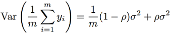

# Predicting-Student-Question-Performance
I led a team of 3 to write an ensemble machine learning model with bagging, to predict whether a student can correctly anwser a diagnositic question. Data includes performance of the same student on other questions, and performance of other students. Our ensemble combined 3 distinct machine learning architectures (K-Nearest Neighbors, Item-Response Theory, Autoencoder) each with bagging to maximize accuracy. 

## Background

## Data
Data contains the responses of 542 students to 1774 diagnostic questions (response is correct or incorrect). It can be visualized as a sparse matrix with each row representing a particular student's responses, and each column representing the responses to a particular question. Only 7% of the matrix is observed (68,000 points). 75%, 10%, and 15% of observed points are used for train, valid and test respectively (ratios are predetermined). 

## Architecture
Steps:
1. Main dataset is subsampled into bags.
2. ML algorithms are run on each bag.
3. Output per algorithm is equally weighted across bags.
4. Final model output is an adjustably weighted mean of algorithms.

### Ensemble and Bagging

#### Theory
The motivation behind this section lies is explained by bias-variance. The expected squared error loss, can be broken down into the following terms.

Y represents the output of our model, while T represents the correct label. Y and T are random variables, with uncertaintly in Y mostly coming from our choice of train data, and uncertainty in T coming from inaccuracies in the labelling process. Below is a visualization for a 1 dimensional output.

Var(t), or the Bayes error, cannot be reduced in our situation.

Bias is reduced via the ensemble. Inuitively we are averaging out the biases or incapabilities of each algorithm in representing our desired function.

Var(y) is reduced via bagging. According to Bienaymé's formula, the mean of n random variables with the same variances σ2 and correlations p is:

Inuitively this makes sense. If our bags are perfectly identical (p = 1), then our outputs are identical and we receive no variance reduction benefits. If our bags are completely independant (p = 0) we receive the full benefits. Therefore we should decorrelate our bags as much as possible. Because our main dataset is limited, we are forced to reuse the same data. We can still make the subsamples however uncorrelated by having some bags focus on different areas of our data. This can be done by either emmitting some data (size of bags are less than size of total dataset), or making some datapoints have heavier weights during training (bagging with replacement, boosting etc).

#### Hyperparameters
For our ensemble, we found the algorithm specific weights using machine learning optimization via PyTorch's modules. Loss was MSE of the validation set. The optimal weights for KNN by user, KNN by question, IRT and Autencoder respectively were [0.04, 0.12, 0.65, 0.19]. 

For bagging, we empiraclly found an optimal bag size of size 0.6\*N. Due to the unique nature of training with sparse matrices, we were unable to  implement bagging with replacement or boosting in the alloted time. Neither were these features expected of us for the project.

### K-Nearest Neighbors
#### Theory
The output of KNN is the the average of the K most similar training examples, where K is an adjustable parameter. When imputing by user, the algorithm will look for the K nearest users who anwsered all the questions similarily. Mathematically, our algorithm will compute the nan euclidean distance of the sparse matrix row of the query point, to all other rows. Nan dimensions are omitted from calculations, with the weights of the other dimensions scaled up appropriately. Imputation by question follows the same procedure but by columns.

#### Hyperparameters
We found an optimal K-value of 11 when imputing by student, and 21 when imputing by question.

### Item Response Theory
This is a mathematical model that predicts a students performance based on 2 parameters, student's ability θi, and question's difficulty βj. In total our model has to optimize 1774 + 542 parameters. In training we sought to maximize the probability of data given the parameters P(D|θ, β). Optimization was done by manually adding the gradient of the parameters with respect to log[P(D|θ, β)].

### Autoencoder
#### Theory
Our goal is to get the Autoencoder to learn useful compressed features of a student's response history that can be used to predict the student's performance on new questions. We train it by passing in a sparse matrix row, that is a 1774 unit long vector containing the responses of a single student. Our loss function is mean squared reconstruction error. Note that loss is not calculated for the held out data points (missing, valid or test points). Validation and test accuracy is calculated by comparing their reconstructed points to the correct labels.

#### Hyperparameters
Hyperparameters were tuned on validation accuracy. Final model is shown below.

## Results
Below is the test accuracy of various models on 10,629 examples.

## Improvements 
